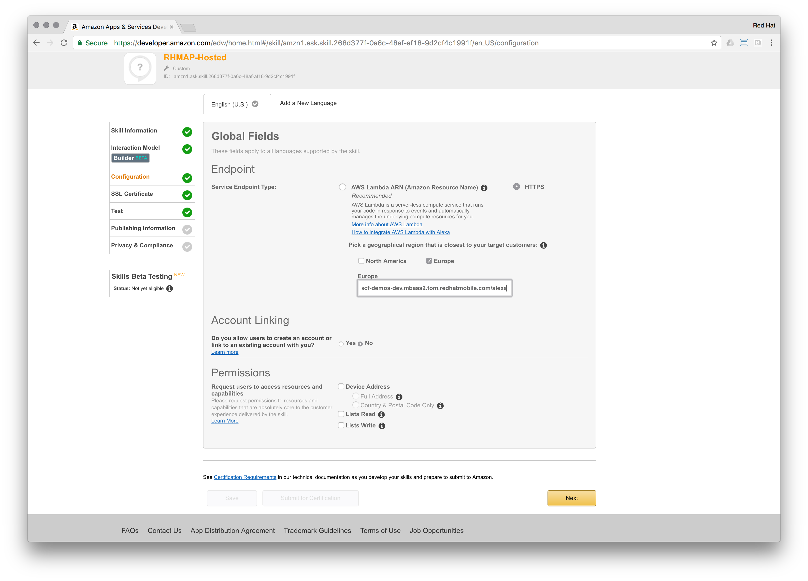

# Building an Alexa skill with Red Hat Mobile Application Platform - Part III

Moving on to the enterprise space: Enterprises often have the requirements to host their services themselves. Those requirements could be driven by:
- Legal restrictions
- Stay in control of who accesses a service
- Protect intellectual property
- Leverage existing on-premise infrastructure and resources

[Red Hat Mobile Application Platform (RHMAP)](https://www.redhat.com/en/technologies/mobile/application-platform) enables you to develop and deploy mobile apps in an agile and flexible manner. Take advantage of open technologies and standard toolkits while centralizing control over security, back-end integrations, and policy management.

RHMAP can be consumed in different ways:
- *SaaS*: Use RHMAP's capabilities fully managed in the Cloud
- *Hybrid*: Use RHMAP's server side on-premise or in a private Cloud
- *On-Premise*: Fully leverage RHMAP (management interface, source code & server side) on-premise or in a private Cloud

This is possible through the use of Red Hat OpenShift Container Platform. As RHMAP is fully containerized, it can be easily deployed on OpenShift, 
giving enterprises the possibility to self-manage and control their Enterprise Mobile Application Platform. Since OpenShift can be used, where-ever Red Hat Enterprise Linux is running (bare metal, virtualized, private Cloud, public Cloud), RHMAP can be consumed in the same ways.

## Part III: Host your own Skill with RHMAP

When it comes down to building Alexa Skills, the only prerequisites are:
- Leveraging the [Alexa Skill SDK (ASK)](http://phx.corporate-ir.net/phoenix.zhtml?c=176060&p=irol-newsArticle&ID=2062551) to facilitate user interaction
- Host a web service to accept requests from Amazon's voice service

Let's recap the [second part](https://github.com/mmetting/Building-an-Alexa-skill-with-Red-Hat-MAP---Part-II) of this article series:

> - Custom Skills can be created in which a function / application on `AWS Lambda` acts as an orchestrator to pull or push data from different internet accessible sources.
> - A subscription with AWS (Amazon Web Services) is necessary to implement `Lambda` functions.
> - `Lambda` is always used on the public Cloud
> - The function on `Lambda` acts with different handlers, triggered by Amazon's voice service

<br>
Since RHMAP can expose web services to the internet and has the ability to include the Alexa Skill SDK (ASK), we can move our Alexa Skill fully under control:

- Decide on where we want to deploy it
- Leverage our own infrastructure
- Control user access
- Protect mission critical intellectual property
- Use existing infrastructure and resources

### Architecture

We'll continue using the [RSS demo project](https://github.com/mmetting/RHMAP-RSS-Reader-Demo) on RHMAP. 


The difference to the [second part](https://github.com/mmetting/Building-an-Alexa-skill-with-Red-Hat-MAP---Part-II) of this article series will be, that Amazon's voice service will directly be connected towards our Cloud Application (RSS Cloud). 


Instead of serving RSS feeds to the user, we will welcome her / him with a smashing "Hello World".

### Exposing a web service via RHMAP including the ASK

The Cloud Application in our project on RHMAP is the server side API for the client apps, based on Node.js. The Alexa Skill SDK can be leveraged in Node.js as a library (module). Considering the Cloud Application as our gateway towards the enterprise, we'll add a new web service endpoint to it.

Additionally, we'll add ASK to handle our request.

Select the Cloud Application > click Editor > open the Cloud Application's `application.js` file:


Add the new `/alexa` endpoint to be exposed:

```
...

securableEndpoints = ['/hello', '/feeds', '/alexa'];

...

app.use('/hello', require('./lib/hello.js')());
app.use('/feeds', require('./lib/feeds.js')());
app.use('/alexa', require('./lib/alexa.js')());

...
```
Make sure, your `application.js` looks like this [reference](https://gist.github.com/mmetting/491effc5c851848642a8c53e935c7c80).

Now open the [`package.json` file](https://gist.github.com/mmetting/13125155afd596368fc4987407f88bb4) and add the Alexa Skill SDK (`"alexa-sdk": "^1.0.9"`) and AWS Lambda Mock Context (`"aws-lambda-mock-context": "^3.1.0"`) to the dependencies section:

```
{
  "name": "helloworld-cloud",
  "version": "0.2.0",
  "dependencies": {
    "alexa-sdk": "^1.0.9",
    "aws-lambda-mock-context": "^3.1.0",
    "body-parser": "~1.0.2",
    "cors": "~2.2.0",
    "express": "~4.0.0",
    "fh-mbaas-api": "6.1.5",
    "request": "2.79.0"
  },
  "devDependencies": {
    "grunt-concurrent": "latest",
    "grunt-contrib-jshint": "^0.11.3",
    "grunt-contrib-watch": "latest",
    "grunt-env": "~0.4.1",
    "grunt-node-inspector": ">=0.2.0",
    "grunt-nodemon": "0.4.2",
    "grunt-open": "~0.2.3",
    "grunt-plato": "~1.0.0",
    "grunt-shell": "^0.7.0",
    "istanbul": "0.2.7",
    "load-grunt-tasks": "^0.4.0",
    "mocha": "^2.1.0",
    "proxyquire": "0.5.3",
    "should": "2.1.1",
    "sinon": "^1.17.2",
    "supertest": "0.8.2",
    "time-grunt": "^0.3.2"
  },
  "main": "application.js",
  "scripts": {
    "test": "grunt unit",
    "debug": "grunt serve",
    "start": "node application.js"
  },
  "license": "mit"
}
```

This will drag the Alexa Skill SDK and a utility library from NPM, while deploying to the server. Now we can use ASK in our source code.

Lets navigate to the `/lib` folder and add a new file called: [`alexa.js`]((https://gist.github.com/mmetting/0182f240e723a5a95ac8755377542366))


Paste the following snippet:

```
var express = require('express');
var bodyParser = require('body-parser');
var cors = require('cors');

const LambdaMockContext = require('aws-lambda-mock-context');
const Alexa = require('alexa-sdk');

function alexaRoute() {
    var alexa = new express.Router();
    alexa.use(cors());
    alexa.use(bodyParser());

    alexa.post('/', function (request, response) {

        var lambdaCtx = LambdaMockContext();

        const handlers = {
            'HelloWorldIntent': function () {
                this.emit(':tell', 'From Red Hat Mobile: Hello World!');
            },
            'AMAZON.HelpIntent': function () {
                this.emit(':tell', 'How can I help you?');
            },
            'AMAZON.StopIntent': function () {
                this.emit(':tell', 'Cheers!');
            },
            'AMAZON.CancelIntent': function () {
                this.emit(':tell', 'Cheers!');
            },
            'SessionEndedRequest': function () {
                this.emit(':tell', 'Good Bye!');
            },
            'Unhandled': function () {
                this.emit(':tell', 'What\'s up?');
            },
        };

        var alexa = Alexa.handler(request.body, lambdaCtx);
        alexa.registerHandlers(handlers);
        alexa.execute();

        lambdaCtx.Promise
            .then(resp => { return response.status(200).json(resp); })
            .catch(err => { console.log(err); })

    });

    return alexa;
}

module.exports = alexaRoute;
```

Essentially what we are doing, is creating the same handlers (like the ones on Lambda), but within our own web service `/alexa` and let the Alexa Skill SDK handle the HTTP-POST requests.

The final step on exposing our newly created web service is deploying to the server side:


Grab the URL of your Cloud Application:


Test your endpoint by issuing an HTTP-POST with the following Body:
```
{
  "session": {
    "sessionId": "SessionId.8d924bf2-a3e5-4151-90f5-eaad6e8f6168",
    "application": {
      "applicationId": "amzn1.ask.skill.268d377f-0a6c-48af-af18-9d2cf4c1991f"
    },
    "attributes": {},
    "user": {
      "userId": "amzn1.ask.account.AEDMXFBEEMKRSNFN6EU74Z3TRIFSF6NQDOY36N3B5UNPCFZKCZVHXCGRKZB7HG22BNSIJH4KHW5UJCSPEPPEU4JM5DBWKZUPA6WDXX7T4EHYJCWSCSOBP33LW5HLCUZDUTMKBSY2HUJTKYREGSKSAVRECMMRXKEYWVICKUV47PFMBIF6T5GH6WVQYDIXFTAREOHMCWSMJCG3IOY"
    },
    "new": true
  },
  "request": {
    "type": "IntentRequest",
    "requestId": "EdwRequestId.841dde0f-3de5-41bb-83a3-eb8c429b33ff",
    "locale": "en-US",
    "timestamp": "2017-05-28T14:42:22Z",
    "intent": {
      "name": "HelloWorldIntent",
      "slots": {}
    }
  },
  "version": "1.0"
}
```

The response should look like the following snippet:
```
{
  "version": "1.0",
  "response": {
    "shouldEndSession": true,
    "outputSpeech": {
      "type": "SSML",
      "ssml": "<speak> From Red Hat Mobile: Hello World! </speak>"
    }
  },
  "sessionAttributes": {}
}
```


> Now we can connect our web service on RHMAP with Alexa

### Setting up the Skill

Here is an overview of the necessary steps (refer to Amazon's documentation for all [details](https://developer.amazon.com/public/solutions/alexa/alexa-skills-kit/overviews/steps-to-build-a-custom-skill)):

1. *Design a Voice User Interface*: We want our Skill to reply with a "Hello World". Therefore, our interaction model will be based on a simple trigger, asking Alexa to "say hello". Additionally, we want the user to be able to ask for help or stop the narration.

2. *Set Up the Skill in the Developer Portal*: We create a new Custom Skill, which can be invoked by saying: "Alexa, ask Red Hat Mobile to say hello".


3. *Use the Voice Design to Build Your Interaction Model*: By using the `Skill Builder`, we created an interaction model. Based on this model, Alexa will reach out to our web service on RHMAP to trigger the "intent" handlers. In each handler, we have the opportunity to respond to the user's interaction by performing the necessary actions.

```
{
  "intents": [
    {
      "name": "AMAZON.CancelIntent",
      "samples": []
    },
    {
      "name": "AMAZON.HelpIntent",
      "samples": []
    },
    {
      "name": "AMAZON.StopIntent",
      "samples": []
    },
    {
      "name": "HelloWorldIntent",
      "samples": [
        "Hello"
      ],
      "slots": []
    }
  ]
}
```

4. *Write and Test the Code for Your Skill*: The time has come to connect our web service on RHMAP to Alexa.



We'll use the HTTPS connection option to specify our own web service hosted on RHMAP. 

> Remember the URL grabbed from the service? - This is the one to paste into the text box.

5. *Check Your SSL certificate*: While we are using HTTPS, we need to establish a trust relationship.


6. *Test Your Custom Skill*: Enjoy the fruits of your [work](https://youtu.be/V2GWNiW5y-8)!
7. Optional - Prepare for publishing
8. Optional - Submit your skill for approval

Now we can leverage our HelloWorld web service not only on mobile or web apps, but also in combination with Amazon's Alexa Skills.